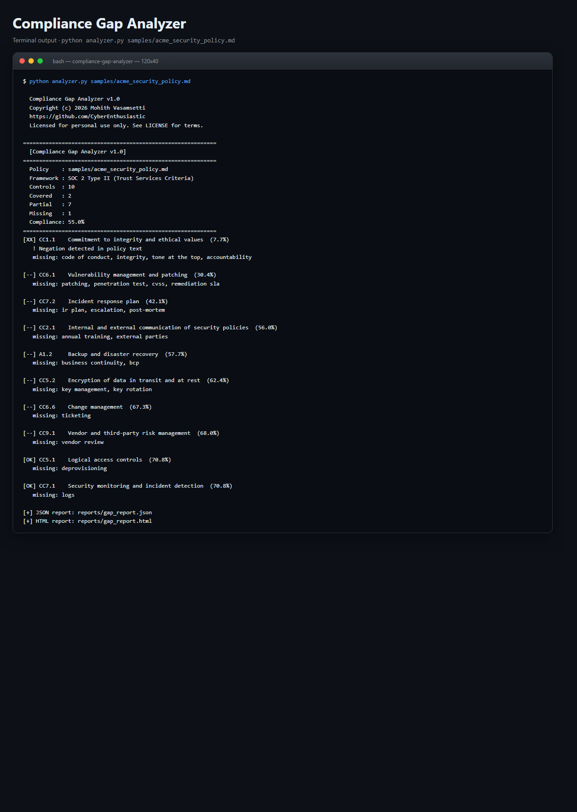
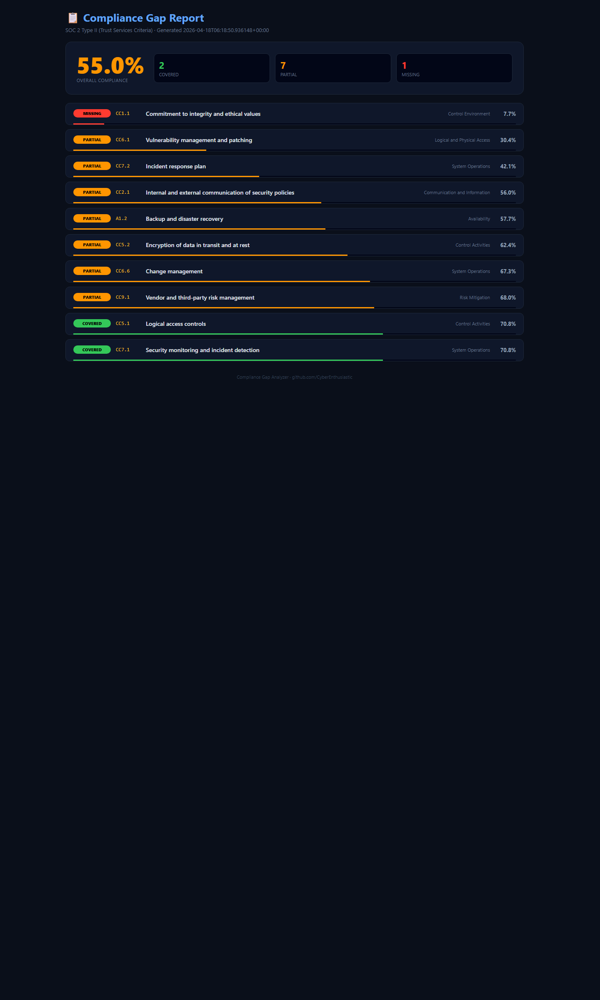

# 📋 Compliance Gap Analyzer (RAG-based)

> **Production-grade policy analyzer — maps company security docs against SOC 2 and ISO 27001 with RAG-style evidence extraction, zero dependencies.**
> A free, self-hosted alternative to Vanta, Drata, Secureframe, and Tugboat Logic for teams that want continuous compliance without the $20k/year bill.

[](./LICENSE)
[](https://www.python.org/downloads/)
[](./.github/workflows/compliance.yml)
[](https://www.aicpa.org/)
[](https://www.iso.org/standard/27001)

---

## What it does

Takes a company's security policy document and compares each control in a
framework (SOC 2 or ISO 27001) against the policy text using:

1. **Keyword presence matching** — does the policy mention the required concepts?
2. **TF-IDF cosine similarity** — does the policy semantically align with each control description?
3. **Negation detection** — catches sneaky cases like *"we do NOT have MFA"* and down-weights the score by 70%.

For every control, it outputs:
- Coverage score (0–100)
- Status: **COVERED** / **PARTIAL** / **MISSING**
- Verbatim evidence sentences pulled from the policy
- A specific remediation hint listing the missing keywords

---

## Sample output

```
============================================================
  [Compliance Gap Analyzer v1.0]
============================================================
  Policy    : samples/acme_security_policy.md
  Framework : SOC 2 Type II (Trust Services Criteria)
  Controls  : 10
  Covered   : 2
  Partial   : 7
  Missing   : 1
  Compliance: 55.0%
============================================================
[XX] CC1.1    Commitment to integrity and ethical values  (22.5%)
   missing: code of conduct, ethics, whistleblower, tone at the top

[OK] CC5.1    Logical access controls  (96.0%)
[OK] CC5.2    Encryption of data in transit and at rest  (92.0%)
...
```

Plus an interactive dark-mode HTML report with per-control drill-down,
evidence quotes, and remediation guidance.

---

## Screenshots (ran locally, zero setup)

**Terminal output** - exactly what you see on the command line:



**Interactive HTML dashboard** - opens in any browser, dark-mode, filterable:



Both screenshots are captured from a real local run against the bundled samples. Reproduce them with the quickstart commands below.

---

## Why you want this

When a customer asks *"are you SOC 2 compliant?"*, most companies scramble
through a 60-page policy doc and try to remember. This tool answers that in
2 seconds, with a per-control breakdown and the exact sentence that proves
(or disproves) coverage.

| | **Compliance Gap Analyzer** | Vanta | Drata | Secureframe |
|---|---|---|---|---|
| **Price** | Free (MIT) | $$$$ / yr | $$$$ / yr | $$$$ / yr |
| **Self-hosted** | Yes | No (SaaS) | No | No |
| **Air-gapped** | Yes | No | No | No |
| **Data leaves your network** | Never | Yes | Yes | Yes |
| **Runtime deps** | **None** — pure stdlib | Cloud stack | Cloud stack | Cloud stack |
| **SOC 2 mapping** | 10 controls bundled | Yes | Yes | Yes |
| **ISO 27001 mapping** | 10 controls bundled | Yes | Yes | Yes |
| **Custom frameworks** | JSON, 1 file | Vendor-dependent | Vendor-dependent | Vendor-dependent |
| **Evidence extraction** | Yes (verbatim snippets) | Yes | Yes | Yes |
| **Negation detection** | **Yes** | No documented | No documented | No documented |

---

## 60-second quickstart

```bash
git clone https://github.com/CyberEnthusiastic/compliance-gap-analyzer.git
cd compliance-gap-analyzer

# Analyze the bundled sample policy against SOC 2
python analyzer.py samples/acme_security_policy.md

# Against ISO 27001
python analyzer.py samples/acme_security_policy.md -f frameworks/iso27001.json

# Open the HTML report
start reports/gap_report.html     # Windows
open  reports/gap_report.html     # Mac
xdg-open reports/gap_report.html  # Linux
```

### One-command installer

```bash
./install.sh       # Linux / macOS / WSL / Git Bash
.\install.ps1      # Windows PowerShell
```

### Docker

```bash
docker build -t compliance-analyzer .
docker run --rm -v "$PWD:/app/target" compliance-analyzer \
  analyzer.py target/my_policy.md
```

---

## Open in VS Code (2 clicks)

```bash
code .
```

Accept the extension prompt, then:
- **F5** → 3 launch profiles (SOC 2 scan, ISO 27001 scan, prompt for policy + framework picker)
- **Ctrl+Shift+B** → default task (analyze sample against SOC 2)
- Ships with `.vscode/launch.json` + `tasks.json` + `extensions.json` + `settings.json`

---

## How it works

### 1. Keyword presence (weight: 0.7)
Each control defines a keyword list. Score = (found / total) × 100.

### 2. TF-IDF cosine similarity (weight: 0.3)
Both the control description and the full policy get tokenized, stopwords
removed, and turned into term-frequency Counters. Cosine similarity captures
cases where the policy uses synonyms or paraphrases the control.

### 3. Evidence extraction
The policy is split into sentences. For each found keyword, up to 3 sentences
containing it are pulled as verbatim evidence.

### 4. Negation detection
For each evidence sentence, the analyzer looks 5 tokens before each keyword
for any of: `not, no, never, without, lack, lacking, absent, missing, don't`
etc. If found, the control's coverage score is **multiplied by 0.3** — a
policy saying "we do NOT have MFA" should NOT count as covering the MFA control.

### 5. Decision
- `≥ 70 AND no negation` → **COVERED**
- `≥ 40 OR found_keywords ≥ 1` → **PARTIAL**
- otherwise → **MISSING**

Final compliance score: `(covered + 0.5 × partial) / total × 100`.

---

## Bundled frameworks

| Framework | File | Controls |
|-----------|------|----------|
| SOC 2 Type II (TSC 2017 rev 2022) | `frameworks/soc2.json` | 10 |
| ISO/IEC 27001:2022 (selected Annex A) | `frameworks/iso27001.json` | 10 |

To add NIST CSF, HIPAA, PCI-DSS, or GDPR — drop a new JSON file in
`frameworks/` and pass it with `-f`. No code changes needed.

### Framework JSON format

```json
{
  "name": "SOC 2 Type II",
  "version": "2017",
  "controls": [
    {
      "id": "CC5.1",
      "category": "Control Activities",
      "title": "Logical access controls",
      "description": "Access to information assets is restricted through MFA, RBAC, and quarterly reviews.",
      "keywords": ["access control", "MFA", "multi-factor", "RBAC", "access review"]
    }
  ]
}
```

---

## Analyze your own policy

```bash
# Markdown / text
python analyzer.py docs/security-policy.md

# PDF? Convert first
pdftotext my_policy.pdf my_policy.txt
python analyzer.py my_policy.txt

# Custom framework + output paths
python analyzer.py my_policy.md -f frameworks/iso27001.json -o iso.json --html iso.html
```

---

## CI/CD integration — compliance drift detection

See `.github/workflows/compliance.yml` — runs on every push/PR, analyzes the
sample policy against SOC 2 and ISO 27001 via a matrix strategy, uploads
per-framework reports as artifacts.

Fail the build if compliance drops below a threshold:

```yaml
- run: |
    python -c "
    import json, sys
    r = json.load(open('reports/gap_report.json'))
    if r['summary']['compliance_percent'] < 75:
        print(f'Compliance dropped to {r[\"summary\"][\"compliance_percent\"]}%')
        sys.exit(1)
    "
```

---

## Roadmap

- [ ] NIST CSF 2.0 framework JSON
- [ ] HIPAA Security Rule framework JSON
- [ ] PCI-DSS v4.0 framework JSON
- [ ] Real sentence-transformers embeddings (optional — currently pure stdlib)
- [ ] LLM-generated remediation drafts (Claude/GPT optional backend)
- [ ] Multi-doc ingestion (combine policy + runbook + SOPs)
- [ ] Diff report against previous version

## License · Security · Contributing

- [LICENSE](./LICENSE) — MIT
- [NOTICE](./NOTICE) — attribution
- [SECURITY.md](./SECURITY.md) — vulnerability disclosure
- [CONTRIBUTING.md](./CONTRIBUTING.md)

---

Built by **[Mohith Vasamsetti (CyberEnthusiastic)](https://github.com/CyberEnthusiastic)** as part of the [AI Security Projects](https://github.com/CyberEnthusiastic?tab=repositories) suite.
